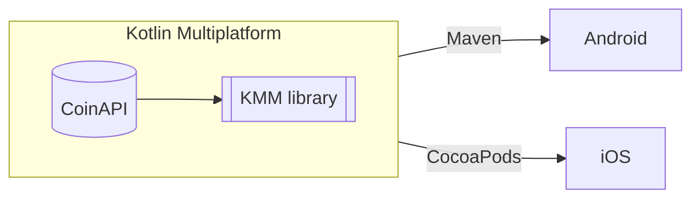

# About
This is demo project for Vilnius KUG meetup to demonstrate Kotlin Multiplatform capabilities to share
code between Android and iOS platforms.

Project uses [CoinAPI](https://www.coinapi.io/) to retrieve a pair of Bitcoin and USD at current
time. Performs round operation to two decimal points and wraps it into data object.

### Architecture


### Libraries used
- [Ktor](https://ktor.io/) - multiplatform http client.
- [Kotlin Serialization](https://kotlinlang.org/docs/serialization.html) - to serialize JSON to data object.
- [BuildKonfig](https://github.com/yshrsmz/BuildKonfig) - multiplatform library to generate data from
property files so that to hide secrets checked in into git repository.

# How to set up
1. Get your free [key](https://www.coinapi.io/market-data-api/pricing) for CoinAPI
2. Under **leprechaun** module create file **key.properties** and set `API_KEY` variable with given key 
you got from CoinAPI

# How to run the project
### Android
Run gradle task `./gradlew build publishToMavenLocal` that will publish the library locally on your machine.

Then, your Android project would need to use dependencies from local repository.
Reference your Android project to local repository in global script or locally in a module.
```gradle
repositories {
    mavenLocal()
}
```

Finally, you should be able to include KMM library into your Android dependencies.

### iOS
You would need to set up cocoapods first, if you don't have installed, then setup using
command `$ sudo gem install cocoapods`.

This demo is intended to use local private CocoaPod repository.

1. Create git repository for pod and publish to your convenient git hosting environment (github, bitbucket etc.).
2. Generate `pod` and iOS framework `./gradlew podPublishXCFramework`.
3. Copy generated framework and podspec file to the pod repository
(update podspec file with necessary changes because Kotlin CocoaPod plugin doesn't include
some configuration based on `build.gradle` configuration script). Push the changes. At the end, it should
look similar to this:
```podspec
Pod::Spec.new do |spec|
   spec.name                     = 'LeprechaunCocoaPod'
   spec.version                  = '1.8'
   spec.homepage                 = 'https://github.com/Vilnius-KUG/leprechaun'
   spec.source                   = { :git=> 'git@github.com:Vilnius-KUG/leprechaun-ios-cocoapod.git',
   :tag => "#{spec.version}"}
   spec.authors                  = ''
   spec.license                  = { :type => "MIT", :file => "LICENSE" }
   spec.summary                  = 'Leprechaun API for Kotlin/Native library'
   spec.static_framework         = true
   spec.vendored_frameworks      = 'leprechaun.xcframework'
   spec.libraries                = 'c++'
   spec.ios.deployment_target    = '13.0'


end
```
4. Create a tag giving version name and push it.
5. Under folder where pod located `pod repo add Leprechaun [Your Leprechaun git URL to pod]`. In case of update, then
execute `pod repo update Leprechaun`.
6. Under folder where pod located push changes `pod repo push Leprechaun LeprechaunCocoaPod.podspec`.
7. Add/Update iOS application's pod dependencies
```podspec
platform :ios, '12.0'

source 'https://github.com/CocoaPods/Specs.git'
source '[Your pod Git URL Goes Here]'

target '[application name]' do
  pod '[pod name]', '~> [pod version]'
end 
```
Then execute `pod update`
# How to use
KMM library exposes public api over class `CryptoRepository`. It has a single function.

```kotlin
fun getExchangeRate(base: String) : Flow<ExchangeRateDomain>
```
Input **base** is crypto asset id in `String` and output is a flow of `ExchangeRateDomain`. 
List of available assets can be found [here](https://docs.coinapi.io/market-data/rest-api/metadata#list-all-assets-get).

`ExchangeRateDomain` is a domain object which holds rate value.
### Android
Since `Flow` is natural in Android, so consume the result of function's at your convenient way.
### iOS
There can be various implementations of `Flow` usage in iOS. Bellow there is a one of samples.

**View**
```swift
struct ContentView: View {
    @StateObject var viewModel = ExhangeRateViewModel(repository: CryptoRepository())
    var body: some View {
        VStack {
            let rate = viewModel.exchangeRate
            Text(String(format: "Exchange rate: %f", rate.rate))
        }
        .padding()
    }
}
```
**ViewModel**
```swift
class ExhangeRateViewModel : ObservableObject {
    @Published var exchangeRate = ExchangeRateDomain(rate: 0.0)
    
    private var subscription: AnyCancellable?
    
    init(repository: CryptoRepository) {
        subscription = ExchangeRatePublisher(repository: repository)
            .assign(to: \.exchangeRate, on: self)
    }
}
```
**Logic**
```swift
class ExchangeRatePublisher : Publisher {
    public typealias Output = ExchangeRateDomain
    public typealias Failure = Never
    
    private let repository: CryptoRepository
    public init(repository: CryptoRepository) {
        self.repository = repository
    }
    
    public func receive<S>(subscriber: S) where S : Subscriber, Never == S.Failure, ExchangeRateDomain == S.Input {
        let subscription = ExchangeRateSubscription(repository: repository, subscriber: subscriber)
        subscriber.receive(subscription: subscription)
    }
    
    final class ExchangeRateSubscription<S: Subscriber>: Subscription where S.Input == ExchangeRateDomain, S.Failure == Failure {
        private var subscriber: S?
        private var job: Kotlinx_coroutines_coreJob? = nil
        
        private let reposittory: CryptoRepository
        
        init(repository: CryptoRepository, subscriber: S) {
            self.subscriber = subscriber
            self.reposittory = repository
            
            job = repository.getExchangeRate(base: "BTC").subscribe(
                scope: FlowExtKt.iosScope,
                onEach: { rate in
                    subscriber.receive(rate!)
                },
                onComplete: { subscriber.receive(completion: .finished) },
                onThrow: { error in debugPrint(error)}
            )
        }
        
        func cancel() {
            subscriber = nil
            job?.cancel(cause: nil)
        }
        
        func request(_ demand: Subscribers.Demand) {}
    }
}
```
# Resources
- [Sharing KMM library with iOS](https://www.notion.so/desquared/Share-KMM-module-with-iOS-via-Cocoa-pods-eaa7c717b83a4805af3dfc72d0e58ac1#2a2417458f8f4e929382775b0a0e8098)
- [Guide: Creating a CocoaPod using Kotlin Multiplatform Mobile library](https://medium.com/elements/guide-creating-a-cocoapod-using-kotlin-multiplatform-mobile-library-c599fff02b40)