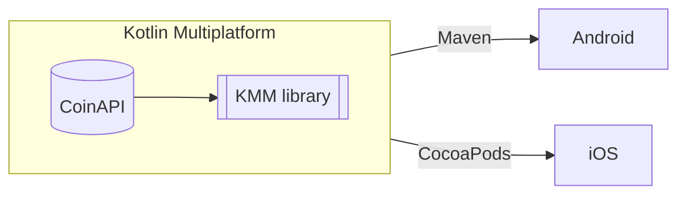

# About
This is demo project for Vilnius KUG meetup to demonstrate Kotlin Multiplatform capabilities to share
code between Android and iOS platforms.

Project uses [CoinAPI](https://www.coinapi.io/) to retrieve a pair of Bitcoin and USD at current
time. Performs round operation to two decimal points and wraps it into data object.

### Architecture


### Libraries used
- [Ktor](https://ktor.io/) - multiplatform http client.
- [Kotlin Serialization](https://kotlinlang.org/docs/serialization.html) - to serialize JSON to data object.
- [BuildKonfig](https://github.com/yshrsmz/BuildKonfig) - multiplatform library to generate data from
property files so that to hide secrets checked in into git repository.

# How to set up
1. Get your free [key](https://www.coinapi.io/market-data-api/pricing) for CoinAPI
2. Under **leprechaun** module create file **key.properties** and set `API_KEY` variable with given key 
you got from CoinAPI

# How to run the project
### Android
Run gradle task `./gradlew build publishToMavenLocal` that will publish the library locally on your machine.

Then, your Android project would need to use dependencies from local repository.
Reference your Android project to local repository in global script or locally in a module.
```gradle
repositories {
    mavenLocal()
}
```

Finally, you should be able to include KMM library into your Android dependencies.

### iOS
You would need to setup cocoapods first, if you don't have installed, then setup using
command `$ sudo gem install cocoapods`.

This demo is intended to use local private CocoaPod repository.

1. Create git repository for pod and publish to your convenient git hosting environment (github, bitbucket etc.).
2. Generate `pod` and iOS framework `./gradlew podPublishXCFramework`.
3. Copy generated framework and podspec file to the pod repository
(update podspec file with necessary changes because Kotlin CocoaPod plugin doesn't include
some configuration based on `build.gradle` configuration script).
4. 

# Resources
- [Sharing KMM library with iOS](https://www.notion.so/desquared/Share-KMM-module-with-iOS-via-Cocoa-pods-eaa7c717b83a4805af3dfc72d0e58ac1#2a2417458f8f4e929382775b0a0e8098)